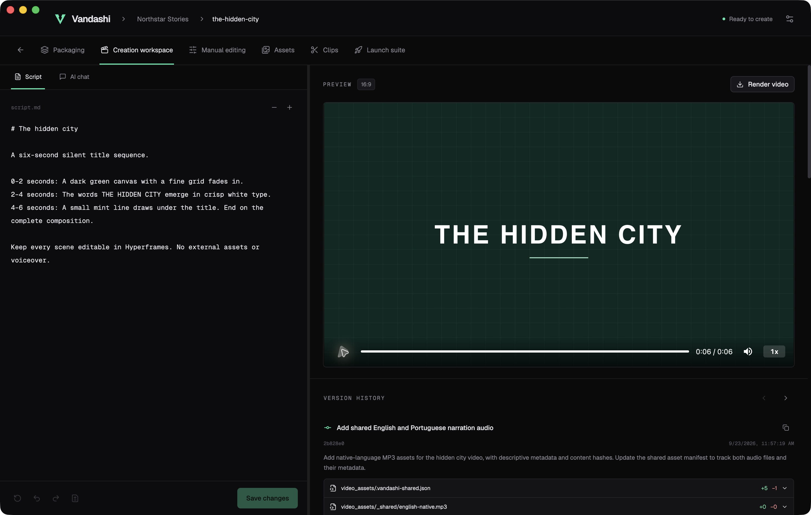
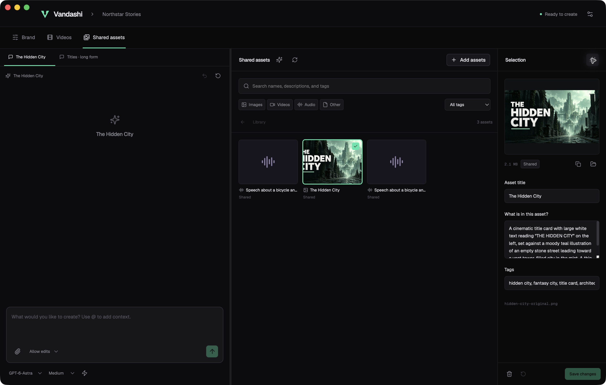

# Vandashi

A local video studio built around your creative direction. Shape a script with Codex, preview an editable Hyperframes composition, make manual adjustments, and turn the finished video into clips.

Vandashi keeps your brand guides, scripts, assets, packaging, and version history in folders on your computer. The app is free and open source. AI requests use your own authenticated Codex account and its available allowance.

**Development preview:** the implementation and integration verification are in progress. See [the acceptance checklist](docs/REQUIREMENTS.md) for verified behavior and outstanding work.

[Explore Vandashi](https://igormidev.github.io/Vandashi/) · [Source and setup](https://github.com/igormidev/Vandashi#run-from-source)



## Run from source

Install Node.js 24, Git, and [Codex CLI](https://developers.openai.com/codex/cli/), then sign in with `codex login`.

```sh
git clone https://github.com/igormidev/Vandashi.git
cd Vandashi
ONNXRUNTIME_NODE_INSTALL=skip npm ci
node node_modules/hyperframes/bin/hyperframes.mjs skills update --json
npm run dev
```

In Windows PowerShell, run `$env:ONNXRUNTIME_NODE_INSTALL='skip'` before `npm ci` instead. This keeps the included CPU inference runtime and skips an unnecessary CUDA download. Local speech inspection downloads a pinned 80 MB model on first use and can temporarily use about 2.3 GB of memory; its worker exits afterward.

The pinned Hyperframes CLI, Studio, and player are included in npm dependencies. Its first render also needs FFmpeg, FFprobe, and a supported Chrome runtime. The workspace preparation screen checks these tools and offers the appropriate setup or recovery guide. Install or repair host tools outside Vandashi, then restart it and check again. Existing Codex settings and conversations are preserved.

## Create a video

1. Choose a folder and create a brand. Refine its channel details and creative-direction guides.
2. Create a landscape or portrait video. Set its packaging and add local or shared assets.
3. Write a script, review the diff, and choose **Save & create** to start the AI edit. You can also work directly in the creation chat.
4. Use **Manual editing** for the embedded Hyperframes Studio. Saving records a Git version and synchronizes the script.
5. Render the video. Landscape projects can produce independent vertical or square clips.
6. Review a destination in **Launch suite**, edit the prepared instructions, then send them. Publishing needs browser tools available to Codex and a signed-in destination account. Vandashi does not claim an upload succeeded without a verified result.

Each contextual conversation persists locally. Read-only mode enforces a read-only Codex sandbox. Only one AI operation runs at a time. Undo uses a recoverable file checkpoint and a matching Codex conversation boundary.



## Local files

```text
Your brand/
  brand_identity/       # Git repository: channel details and creative guides
  shared_assets/        # Git repository: reusable media and metadata
  videos/
    your-video/         # Independent Git repository
      script.md
      video_packaging.yml
      launch.yml
      index.html
      hyperframes.json
      video_assets/
      thumbnails/
      clips/            # Each clip has an independent repository
```

The app stores preferences and conversation records in the operating system's application-data folder. File metadata uses embedded fields where supported and readable sidecars for other formats. Projects are not uploaded to a Vandashi service. Codex requests and any publishing action use the external services you configure.

## Development

```sh
npm run check          # Types, strict lint, architecture, tests, production bundle
npm run test:e2e       # Actual Electron shell and workflow tests
npm run test:site      # Production landing page in Chromium, Firefox, and WebKit
npm run package:dir    # Build an unpacked native app for this machine
npm run package        # Verify and create native installers
```

`npm ci` installs a pre-commit hook that runs the complete verification gate. CI runs it on macOS, Windows, and Linux, then tests Electron and packages the app. Live Codex tests are opt-in because they use a signed-in account; live media tests require the rendering tools. See [Codex integration](docs/CODEX.md), [Hyperframes integration](docs/HYPERFRAMES.md), and [architecture](docs/ARCHITECTURE.md).

The separate [landing page](landing/) uses the same strict source checks and a production build under `/Vandashi/`. See [site maintenance](docs/SITE.md) for language catalogs, screenshot provenance, responsive checks, and GitHub Pages deployment.

## Ask an agent to install it

Copy this prompt into a coding agent with local terminal access:

> Install and open Vandashi from https://github.com/igormidev/Vandashi. Inspect its README and AGENTS.md first. Use the latest repository state and Node.js 24. Set ONNXRUNTIME_NODE_INSTALL=skip in the installation environment, then run npm ci to use the included CPU inference runtime without downloading CUDA. Check Git and Codex CLI; install missing prerequisites from their official sources without replacing my existing configurations. Ask me to sign in directly if Codex needs authentication. Install the bundled Hyperframes skill with `node node_modules/hyperframes/bin/hyperframes.mjs skills update --json`, verify the media prerequisites, run the checks, then start `npm run dev` and open the desktop app. Keep my existing projects and credentials intact. Report any failed dependency check with the exact error.

## References and license

Vandashi's code is MIT. It uses [Codex](https://github.com/openai/codex) and [Hyperframes](https://github.com/heygen-com/hyperframes). [T3 Code](https://github.com/pingdotgg/t3code) informed the conversation and diff workflows. Dependencies retain their own licenses, including GSAP's separate terms; see [third-party notices](THIRD_PARTY_NOTICES.md) for exact versions, original notices, and source provenance.
