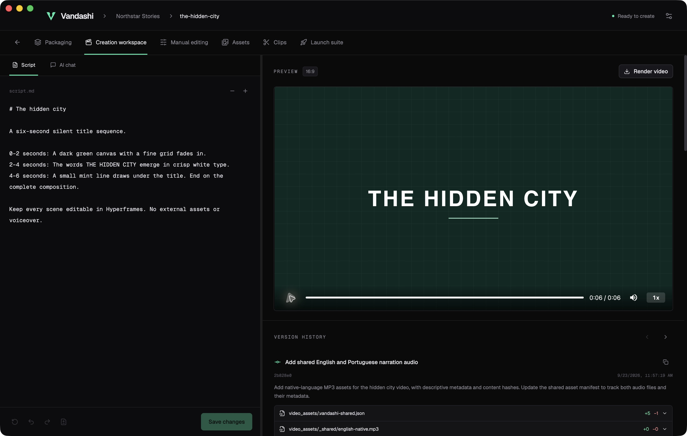
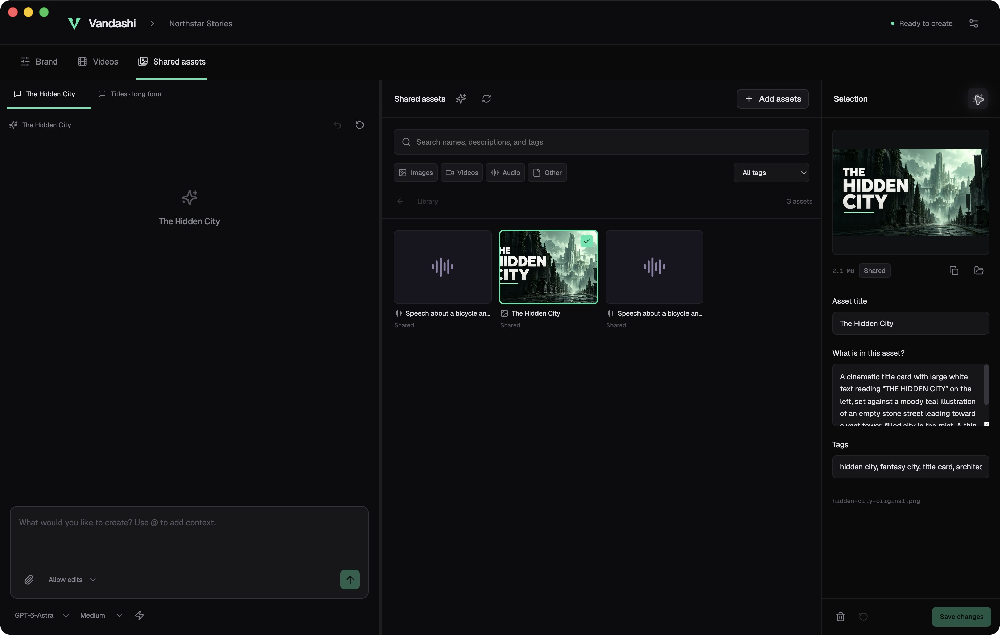

# Vandashi

A local video studio built around your creative direction. Shape a script with Codex, preview an editable Hyperframes composition, make manual adjustments, and turn the finished video into clips.

Vandashi keeps your brand guides, scripts, assets, packaging, and version history in folders on your computer. The app is free and open source. AI requests use your own authenticated Codex account and its available allowance.

**Development preview:** the implementation and integration verification are in progress. See [the acceptance checklist](docs/REQUIREMENTS.md) for verified behavior and outstanding work.

[Explore Vandashi](https://igormidev.github.io/Vandashi/) · [Source and setup](https://github.com/igormidev/Vandashi#run-from-source)



September 23, 2026 · earlier interface (revision `6795514`).

## Run from source

Install Node.js 24, Git, and [Codex CLI](https://developers.openai.com/codex/cli/), then sign in with `codex login`.

```sh
git clone https://github.com/igormidev/Vandashi.git
cd Vandashi
ONNXRUNTIME_NODE_INSTALL=skip npm ci
node node_modules/hyperframes/bin/hyperframes.mjs skills update --json
npm run dev
```

In Windows PowerShell, run `$env:ONNXRUNTIME_NODE_INSTALL='skip'` before `npm ci` instead. This keeps the included CPU inference runtime and skips an unnecessary CUDA download. On first launch, Vandashi installs its private Python/WhisperX tools and downloads the default large-v3-turbo speech model. Initial setup needs internet and several GB of free disk space (the speech model alone is about 1.62 GB). Audio/video metadata includes full-file speech timing; choose another local model in Settings. See [audio/video transcription](docs/TRANSCRIPTION.md).

The pinned Hyperframes CLI, Studio, and player are included in npm dependencies. Its first render also needs FFmpeg, FFprobe, and a supported Chrome runtime. The workspace preparation screen checks these tools. When Codex is available, choose **Ask AI to install for me** to open a prepared installation chat, review the request and send it in install mode. That mode grants host access for setup. Vandashi checks again automatically after the chat finishes and continues only when all checks pass. Manual installation guides remain available; Codex/login/quota, bundled-app and Git recovery failures require their indicated setup steps. Existing settings and conversations are preserved.

On Linux, Chromium sandbox support is required. Distributions that restrict unprivileged
user namespaces may need an administrator-approved AppArmor profile for the exact
Vandashi executable. The AppImage does not automatically disable sandboxing when that
support is unavailable. See [packaged verification](docs/PACKAGED-VERIFICATION.md) for
the launcher contract and CI checks.

## Create a video

1. Choose a folder and create a brand. Refine its channel details and creative-direction guides.
2. Create a landscape or portrait video. Set its packaging and add local or shared assets.
3. Write a script, review the diff, and choose **Save & create** to start the AI edit. You can also work directly in the creation chat.
4. Use **Manual editing** for the embedded Hyperframes Studio. Saving records a Git version and synchronizes the script.
5. Render the video. Landscape projects can produce independent vertical or square clips.
6. Review a destination in **Launch suite**, edit the prepared instructions, then send them. Publishing needs browser tools available to Codex and a signed-in destination account. Vandashi does not claim an upload succeeded without a verified result.

Each contextual conversation persists locally. Read-only mode enforces a read-only Codex sandbox. Only one AI operation runs at a time. Project Undo uses a recoverable file checkpoint and a matching Codex conversation boundary. Host installations cannot be reverted with Git Undo.



September 23, 2026 · earlier interface (revision `6795514`).

## Local files

```text
Your brand/
  brand_identity/       # Git repository: channel details and creative guides
  shared_assets/        # Git repository: reusable media and metadata
  edition_presets/     # Git repository: named editing presets and HOW_TO_USE.md
  videos/
    your-video/         # Independent Git repository
      script.md
      video_packaging.yml
      launch.yml
      index.html
      hyperframes.json
      video_assets/
      thumbnails/
      clips/            # Each clip has an independent repository
```

The app stores preferences and conversation records in the operating system's application-data folder. File metadata uses embedded fields where supported and readable sidecars for other formats. Projects are not uploaded to a Vandashi service. Codex requests and any publishing action use the external services you configure.

## Development

```sh
npm run check          # Version, formatting, types, lint, architecture, production builds; no tests
npm run package:dir    # Build an unpacked native app for this machine
npm run package        # Verify and create native installers
```

AI agents run only tests created for the current task. Select exact files and, when
adding cases to existing files, filter to the new case names. Full suites require an
explicit user request; implementation, commit and release requests do not grant that
permission. See the mandatory [agent test policy](AGENTS.md).

`npm ci` installs a pre-commit hook that checks an immutable staged snapshot using
`npm run check`, without running tests. `npm run check:all` additionally runs the
complete unit suite and is opt-in. `npm run test:e2e` and `npm run test:site` are also
full-suite commands, not routine AI task checks. Automated CI verifies source on
macOS, Windows and Linux, then handles native and site release checks separately.
Live Codex tests use a signed-in account; live media tests require rendering tools.
See [Codex integration](docs/CODEX.md), [Hyperframes integration](docs/HYPERFRAMES.md),
and [architecture](docs/ARCHITECTURE.md).

The separate [landing page](landing/) uses the same strict source checks and a production build under `/Vandashi/`. See [site maintenance](docs/SITE.md) for language catalogs, screenshot provenance, responsive checks, and GitHub Pages deployment.

## Ask an agent to install it

Copy this prompt into a coding agent with local terminal access:

> Install and open Vandashi from https://github.com/igormidev/Vandashi. Inspect its README and AGENTS.md first. Use the latest repository state and Node.js 24. Set ONNXRUNTIME_NODE_INSTALL=skip in the installation environment, then run npm ci to use the included CPU inference runtime without downloading CUDA. Check Git and Codex CLI; install missing prerequisites from their official sources without replacing my existing configurations. Ask me to sign in directly if Codex needs authentication. Install the bundled Hyperframes skill with `node node_modules/hyperframes/bin/hyperframes.mjs skills update --json`, verify the media prerequisites, run `npm run check` (static checks and builds only; no full test suites), then start `npm run dev` and open the desktop app. Keep my existing projects and credentials intact. Report any failed dependency check with the exact error.

## References and license

Vandashi's code is MIT. It uses [Codex](https://github.com/openai/codex) and [Hyperframes](https://github.com/heygen-com/hyperframes). [T3 Code](https://github.com/pingdotgg/t3code) informed the conversation and diff workflows. Dependencies retain their own licenses, including GSAP's separate terms; see [third-party notices](THIRD_PARTY_NOTICES.md) for exact versions, original notices, and source provenance.
